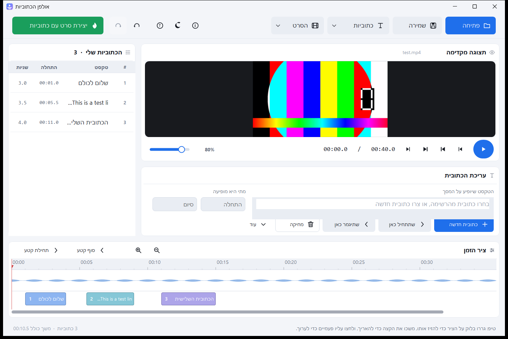

# אולפן הכתוביות · Subtitle Studio

**כתיבה, תיקון והטמעה של כתוביות. קובץ אחד, בלי התקנה.**
*Write, fix and burn subtitles. One file, no install.*

### [⬇ הורדה · Download](../../releases/latest)

---

## מה אפשר לעשות

**כתוביות**
- לכתוב כתוביות מול פס הקול של הסרט, ולגרור אותן למקום
- לפתוח קובץ קיים: `SRT` · `VTT` · `ASS` · `SUB`, או טקסט רגיל שיתחלק לבד
- קבצים ישנים בעברית נפתחים בעברית, לא בג׳יבריש
- לשלוף כתוביות מתוך סרט — לתרגום או להחלפה
- לתקן סנכרון: עוצרים את הסרט איפה שהמשפט באמת נשמע, והתוכנה מזיזה בעצמה —
  את כולן, מכאן והלאה, או אחת בלבד
- לתקן לבד חפיפות, כתוביות קצרות מדי ושורות ארוכות מדי
- לבחור גופן, גודל, צבע, מסגרת ומיקום — ולראות מיד איך זה ייראה

**וידאו**
- לצרוב את הכתוביות בתוך התמונה (עברית יוצאת נכון) או להוסיף אותן כערוץ נפרד
- לחתוך קטע מהסרט בסימון על הציר
- עוצמת שמע · ניקוי רעש · הפרדת שמע · המרה · סיבוב · חיתוך שוליים · האטה והאצה ·
  עמעום · איחוד קבצים · GIF · תמונה מייצגת · גרסה לנייד
- להקטין קובץ לגודל מבוקש: אומרים ״עד 200MB״ ומקבלים את האיכות הכי טובה שנכנסת
- כל פעולה יוצאת באיכות מקסימלית כברירת מחדל, והסרט המקורי לא משתנה

## הורדה

[הורידו את `SubtitleStudio.exe`](../../releases/latest) והריצו. ווינדוס 10 או 11.

אין התקנה ואין צורך באינטרנט. בהפעלה הראשונה התוכנה פורסת את מנוע הווידאו — כמה שניות, פעם אחת.
לשימוש מדיסק‑און‑קי: הניחו לידה קובץ ריק בשם `portable.txt`.

---

## English

**Subtitles** — write against the waveform and drag into place · open `SRT` `VTT` `ASS`
`SUB` or plain text · legacy Hebrew encodings open correctly · extract a subtitle track
from a video · fix sync by pausing where the line is actually spoken (all cues, from
here on, or just one) · auto-fix overlaps and too-short cues · font, size, colour,
outline and position with live preview.

**Video** — burn subtitles into the picture (correct Hebrew RTL) or mux as a separate
track · trim visually · volume, denoise, extract audio, convert, rotate, crop, speed,
fade, join, GIF, thumbnail, phone version · shrink to a target size ("under 200MB")
with two-pass encoding · max quality by default, original file never modified.

[Download `SubtitleStudio.exe`](../../releases/latest) and run it. Windows 10 or 11,
no installer, no internet, no dependencies.

---

רישוי: קוד התוכנה [MIT](LICENSE) · מנוע הווידאו FFmpeg תחת GPLv3 — [פרטים](THIRD-PARTY.md)
· בנייה מהמקור: `build.cmd` ([פרטים](CLAUDE.md))
