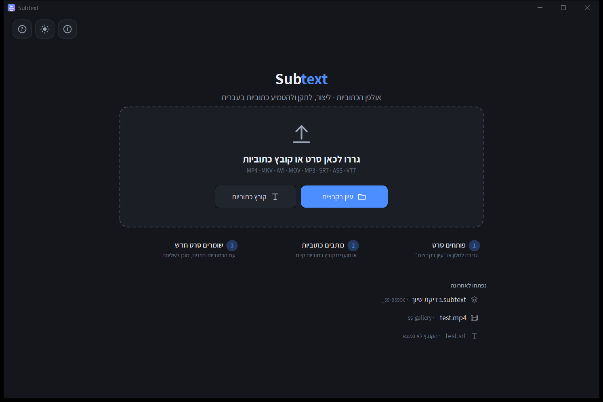

# אולפן הכתוביות

**תוכנה חינמית לווינדוס שמוסיפה כתוביות לסרטים.**
בלי התקנה · בלי אינטרנט · בלי הרשמה · הכול בעברית

### [⬇ להורדה](../../releases/latest)

---

## מה אפשר לעשות

**לכתוב כתוביות לסרט**
פותחים סרט, רואים את פס הקול, וגוררים על הציר איפה שכל משפט צריך להופיע. כותבים את הטקסט — ורואים אותו מיד על התמונה.

**לתקן כתוביות שלא מסונכרנות**
עוצרים את הסרט במקום שבו המשפט באמת נשמע, לוחצים כפתור — והתוכנה מזיזה את הכול בעצמה. אפשר לתקן את כל הכתוביות, רק מכאן והלאה, או רק אחת.

**להוסיף את הכתוביות לסרט עצמו**
או צרובות בתמונה — כך הן נראות בכל נגן, בוואטסאפ ובטלפון — או כערוץ כתוביות נפרד שאפשר לכבות.

**לפתוח קבצים שאחרים שלחו**
`SRT` · `VTT` · `ASS` · `SUB`, וגם טקסט רגיל שהתוכנה מחלקת לכתוביות לבד. קבצים ישנים בעברית נפתחים כמו שצריך ולא כג׳יבריש.

**לתרגם כתוביות אוטומטית**
בוחרים שפה, והתוכנה מתרגמת הכול בלי לגעת בתזמונים. יש גם עוזר שאפשר לבקש ממנו דברים במילים רגילות: "תקן חפיפות", "תגדיל את הכתוביות", "תכין גרסה שנכנסת ב‑200 מגה".
*(דורש חיבור לאינטרנט ומפתח חינמי מגוגל — התוכנה מסבירה בדיוק איך משיגים אותו.)*

**עוד דברים שימושיים לסרט**
לחתוך קטע · להגביר או להנמיך את הקול · לנקות רעש רקע · להוציא את הפסקול · להמיר פורמט · לסובב · להאט או להאיץ · להפוך לאחור · ליצור GIF · ולהקטין קובץ לגודל מבוקש (״שייכנס ל‑200MB״).

**הסרט המקורי שלכם אף פעם לא משתנה.** כל פעולה יוצרת קובץ חדש.

---

## איך מתחילים

1. [מורידים את הקובץ](../../releases/latest) — `SubtitleStudio.exe`
2. לוחצים עליו פעמיים. אין התקנה.
3. גוררים סרט לחלון — ומתחילים.

בפעם הראשונה התוכנה מתארגנת כמה שניות (היא פורסת את מנוע הווידאו שבתוכה). מהפעם השנייה היא נפתחת מיד.

**דרישות:** ווינדוס 10 או 11. שום דבר נוסף.

**רוצים שהכול יישב על דיסק‑און‑קי?** שימו לצד הקובץ קובץ ריק בשם `portable.txt`.

---

## שאלות

**זה באמת חינם?** כן, לגמרי. גם בלי פרסומות וגם בלי הרשמה.

**צריך אינטרנט?** לא. הכול עובד על המחשב שלכם. אינטרנט נחוץ רק לתרגום האוטומטי ולבדיקת עדכונים.

**למה הקובץ שוקל 72 מגה?** כי מנוע הווידאו יושב בתוכו. ככה לא צריך להתקין שום דבר בנפרד.

**ווינדוס מזהיר לפני הפתיחה?** זה קורה לכל תוכנה חדשה שאין לה חתימה בתשלום. לוחצים ״מידע נוסף״ ואז ״הפעל בכל זאת״.

**מצאתי תקלה / חסר לי משהו** — [כתבו כאן](../../issues), בעברית, ואשמח לתקן.

---

## English

**Free Windows app for adding subtitles to videos.** No install, no internet, no sign‑up.

Write subtitles against the waveform · fix out‑of‑sync subtitles by pointing at where a line is actually spoken · burn them into the picture (correct Hebrew RTL) or add them as a separate track · open SRT/VTT/ASS/SUB or plain text · translate automatically · trim, adjust volume, denoise, convert, reverse, make a GIF, shrink to a target size. Your original file is never modified.

[**Download**](../../releases/latest) `SubtitleStudio.exe` and run it. Windows 10 or 11.

---

קוד התוכנה תחת רישיון [MIT](LICENSE) · מנוע הווידאו [FFmpeg](THIRD-PARTY.md) תחת GPLv3

