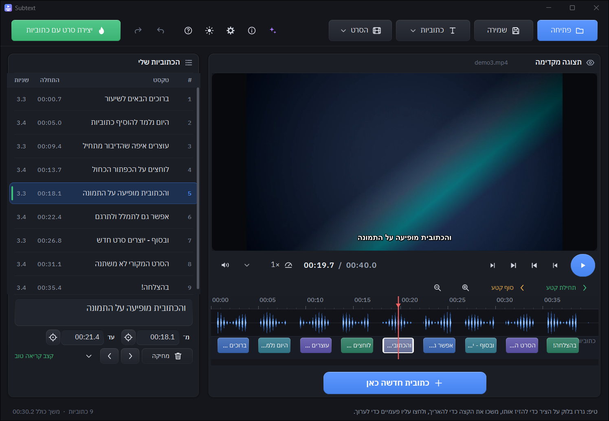
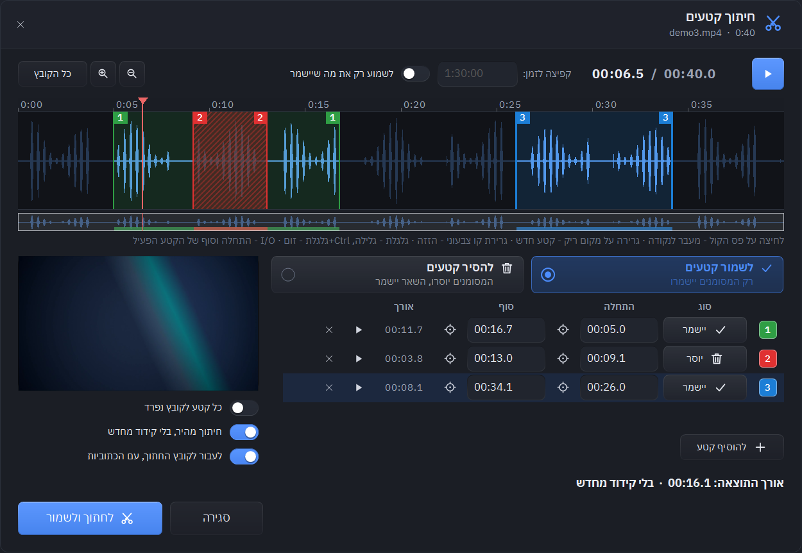
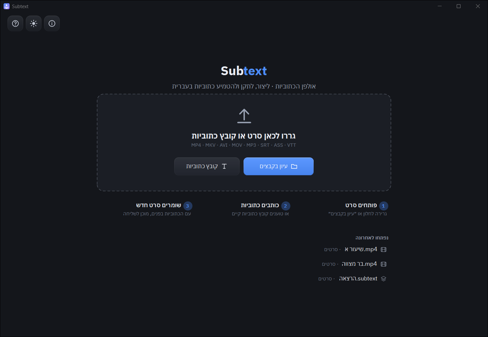
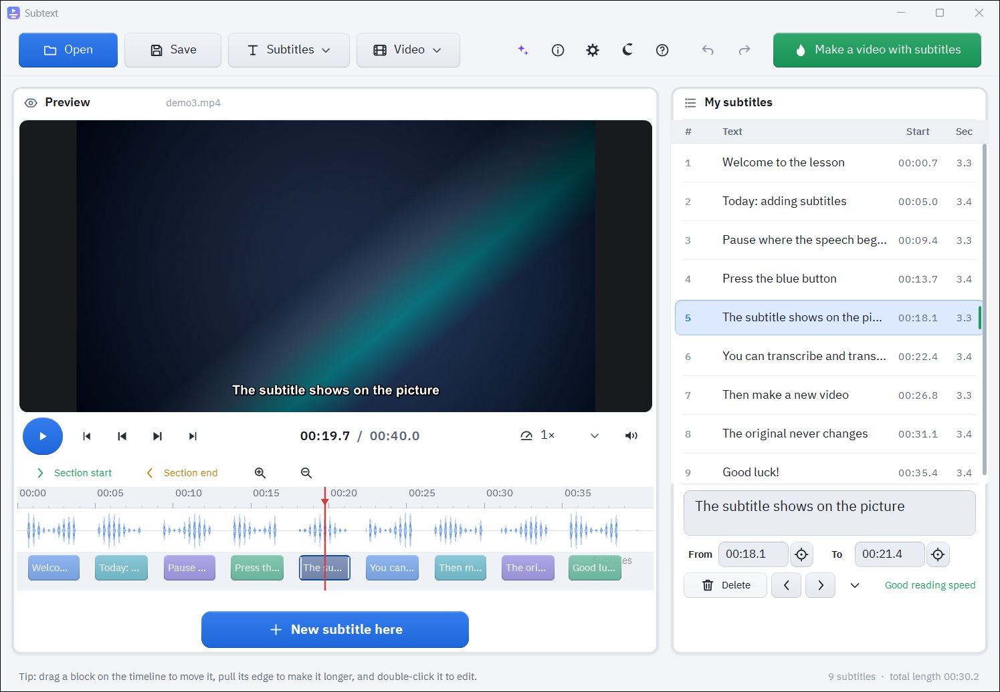

# Subtext

### אולפן הכתוביות

**לכתוב, לתמלל, לתרגם - ולהטמיע בסרט. בעברית, בחינם.**

בלי התקנה | בלי הרשמה | עובדת גם בלי אינטרנט | עברית ואנגלית

### [⬇ להורדה](../../releases/latest)

‏`Subtext.exe` - בלי התקנה · ‏`Subtext-Setup.exe` - עם קיצור בתפריט התחל

 

> 🎬 עוצרים את הסרט איפה שמדברים, לוחצים על הכפתור הכחול - וכותבים. זה כל הסוד.

---

## ✨ מה אפשר לעשות

### ✍️ לכתוב כתוביות

* **בלחיצה אחת** - עוצרים איפה שהדיבור מתחיל, לוחצים, כותבים. הכתובית מופיעה מיד על התמונה.
* **בקצב שלכם** - אפשר להאט את ההשמעה, ולקפוץ אחורה וקדימה תוך כדי כתיבה.
* **מקבצים שכבר יש** - `SRT` · `VTT` · `ASS` · `SUB`, וגם טקסט רגיל שהתוכנה מחלקת לכתוביות ומתזמנת לפי הדיבור.
* **עברית ישנה** - קבצים בקידוד ישן נפתחים כמו שצריך, ולא כג׳יבריש.

### 🤖 לתמלל ולתרגם אוטומטית

* **תמלול** - התוכנה מאזינה וכותבת לבד, עם התזמונים. מפרידה בין דוברים, ומסמנת מילה שלא נשמעה ברור.
* **תרגום** - לכל שפה, והשורות מסתדרות לקריאה נוחה.
* **עוזר** - מבקשים במילים רגילות: ״תקן חפיפות״, ״תגדיל את הכתוביות״, ״תכין גרסה שנכנסת ב-200 מגה״.
* **רק קטע** - מסמנים על הציר (`I` ו-`O`), והתמלול, התרגום והתזמון רצים רק עליו.
* **פרטיות** - השמע נשלח החוצה רק אחרי אישור מפורש. זו הפעולה היחידה ששולחת את התוכן עצמו.

דורש אינטרנט ומפתח חינמי: מגוגל, או מ-Groq (עד 8 שעות הקלטה ביום). התוכנה מסבירה בדיוק איך משיגים אותו.

### 🎯 לתקן ולבדוק

* **סנכרון** - עוצרים איפה שהמשפט באמת נשמע, והתוכנה מזיזה הכול. או רק מכאן והלאה, או רק אחת.
* **בדיקת שגיאות** - חפיפות, מהירות קריאה, שורות ארוכות ומילים לא בטוחות. לחיצה קופצת לבעיה, ויש ״לתקן אוטומטית״.
* **איות** - מכיר גם ארמית של הגמרא וראשי תיבות, וקליק ימני מציע תיקון. המילון חינמי (1.2MB) ויורד פעם אחת.

### 🎞️ להכניס לסרט

* **צרובות בתמונה** - נראות בכל נגן ובכל טלפון, ועברית מימין לשמאל כמו שצריך.
* **ערוץ נפרד** - כתוביות שאפשר להדליק ולכבות.

### ✂️ לחתוך

* **כמה קטעים בבת אחת** - ישר על פס הקול: לשמור או להסיר.
* **לשמוע לפני ששומרים** - הניגון מדלג על מה שיוסר.
* **קובץ לכל קטע** - או הכול מחובר לקובץ אחד.
* **בלי פגיעה באיכות** - `MP3`, ‏`WAV` ודומיהם נחתכים בלי קידוד מחדש. ואם יש כתוביות - הן זזות יחד עם הסרט.

### 🧰 ועוד

להגביר או להנמיך את הקול · לנקות רעש רקע · להוציא את הפסקול · להמיר פורמט · לסובב · להאט או להאיץ · להפוך לאחור · ליצור GIF · להקטין לגודל מבוקש (״שייכנס ל-200MB״)

> 📌 **שורה תחתונה:** הסרט המקורי שלכם אף פעם לא משתנה. כל פעולה יוצרת קובץ חדש.

---

## ⌨️ קיצורים שכדאי להכיר

| | |
|---|---|
| רווח | ניגון ועצירה |
| חצים ← → | קפיצה של שתי שניות |
| `Ctrl` + חצים | אותו דבר, גם באמצע כתיבה |
| `Ctrl` + רווח | ניגון ועצירה באמצע כתיבה |
| `Ctrl` + ↑ ↓ | מהירות ההשמעה |
| `Insert` | כתובית חדשה במקום שבו הסרט עומד |
| `Q` / `W` | התחלה / סיום של הכתובית כאן |
| `I` / `O` | סימון קטע: חיתוך, תמלול ועוד |
| קליק ימני ברשימה | תיקון איות, חלוקה לשתיים, איחוד, מחיקה |
| `Ctrl` + `K` | העוזר |
| `F5` | יצירת הסרט עם הכתוביות |
| `Ctrl` + `Z` | ביטול |

כל הקיצורים נמצאים גם בתוכנה עצמה, בכפתור העזרה.

---

## 🚀 איך מתחילים

1. [מורידים את הקובץ](../../releases/latest) - `Subtext.exe`
2. לוחצים עליו פעמיים. אין התקנה.
3. גוררים סרט לחלון - ומתחילים.

בפעם הראשונה התוכנה מתארגנת כמה שניות (היא פורסת את מנוע הווידאו שבתוכה). מהפעם השנייה - מיד.

* **דרישות** - ווינדוס 10 או 11, 64 סיביות (כל מחשב מהעשור האחרון). בלי שום התקנה נוספת, בלי קודקים.
* **שתי דרכים, אותה תוכנה** - `Subtext.exe` רץ כמו שהוא. `Subtext-Setup.exe` מוסיף קיצור בתפריט התחל ושורה ברשימת התוכנות, בלי הרשאות מנהל. פרטים: [INSTALL.md](INSTALL.md).
* **על דיסק-און-קי** - שימו לצד הקובץ קובץ ריק בשם `portable.txt`, והכול יישב שם.

---

## ❓ שאלות

**זה באמת חינם?**\
כן, לגמרי. בלי פרסומות ובלי הרשמה.

**צריך אינטרנט?**\
לא. הכול עובד על המחשב שלכם. אינטרנט נחוץ רק לתמלול ולתרגום האוטומטיים, ולבדיקת עדכונים.

**ומה עם אנגלית?**\
כל התוכנה קיימת גם באנגלית. היא נפתחת בעברית כשהווינדוס בעברית (או כשיש בו מקלדת עברית), ואפשר להחליף בהגדרות.

**למה הקובץ שוקל 28 מגה?**\
כי מנוע הווידאו יושב בתוכו. ככה לא צריך להתקין שום דבר בנפרד. ועדכון מוריד רק את התוכנה - כחצי מגה.

**ווינדוס מזהיר לפני הפתיחה?**\
זה קורה לכל תוכנה חדשה שאין לה חתימה בתשלום. לוחצים ״מידע נוסף״ ואז ״הפעל בכל זאת״.

**מצאתי תקלה / חסר לי משהו**\
[כתבו כאן](../../issues), בעברית, ואשמח לתקן 🙏

---

## 📜 רישיון · License

**הקוד חופשי לגמרי (MIT).** אפשר לקחת אותו, לשנות, לבנות ממנו מוצר אחר, ולמכור - בלי לבקש רשות.
גרסה למק או ללינוקס? בדיוק סוג הדבר שמותר ורצוי: כל מה שאינו WinForms הוא C# רגיל, והמנוע פשוט מריץ `ffmpeg` בשורת פקודה.

לצד הקוד שלנו יש שני רכיבים של אחרים: **FFmpeg** תחת GPLv3, ו**גופן IBM Plex Sans Hebrew** תחת OFL 1.1.
הנוסח המלא של שלושת הרישיונות נמצא ב־[`licenses/`](licenses), וגם **בתוך התוכנה** - ״על התוכנה ← שמירת נוסח הרישיונות לתיקייה״.
הפירוט המלא, כולל הצעת קוד המקור של FFmpeg: [THIRD-PARTY.md](THIRD-PARTY.md).

*Our code is **MIT** - take it, change it, ship it, sell it. A macOS or Linux port is
explicitly welcome. The released EXE also bundles **FFmpeg** (GPLv3) and the
**IBM Plex Sans Hebrew** font (OFL 1.1); full texts are in [`licenses/`](licenses) and inside the
app itself. See [THIRD-PARTY.md](THIRD-PARTY.md) for the details and the FFmpeg source
offer.*

---

## 🌍 English

**A free Windows app for subtitles: write, transcribe, translate - and put them into the video.**
Built for Hebrew (right‑to‑left done properly), with a complete English interface. No install, no sign‑up, and it works offline.

* **Write** subtitles against the waveform; each one shows on the picture as you type.
* **Open** SRT, VTT, ASS or SUB - or plain text, split into subtitles and timed to the speech. Old Hebrew encodings open correctly.
* **Transcribe** automatically, with speakers separated and unsure words marked, and **translate** into any language. Online, with a free key from Google or Groq; the audio is sent only after you agree.
* **Work on part of the video** - mark a section (`I` / `O`) and transcription, translation and timing run on it alone.
* **Fix out‑of‑sync subtitles** by pointing at where a line is actually spoken, and **check** for overlaps, reading speed, long lines and spelling.
* **Burn** the subtitles into the picture, or add them as a separate track.
* **Cut** several sections at once on the waveform - keep or remove, hear the result first, or save each section to its own file. MP3, WAV and the like are cut without re‑encoding, and the subtitles move with the video.
* Volume, noise reduction, extract the audio, convert, rotate, speed, reverse, GIF, and shrink to a target size.

> 📌 Your original file is never modified.

[**Download**](../../releases/latest) `Subtext.exe` and run it. Windows 10 or 11, 64‑bit.

---

קוד התוכנה תחת [MIT](LICENSE) · ‏[FFmpeg](THIRD-PARTY.md) תחת GPLv3 · גופן [IBM Plex Sans Hebrew](THIRD-PARTY.md) תחת OFL 1.1

